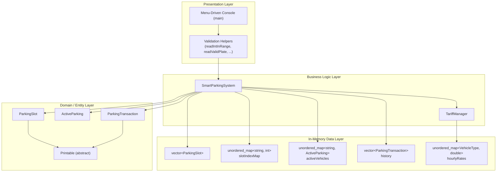
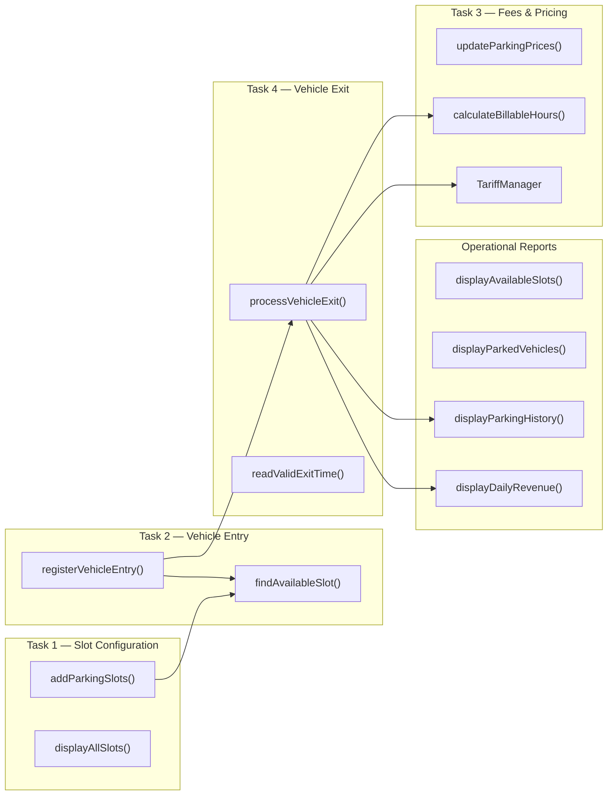
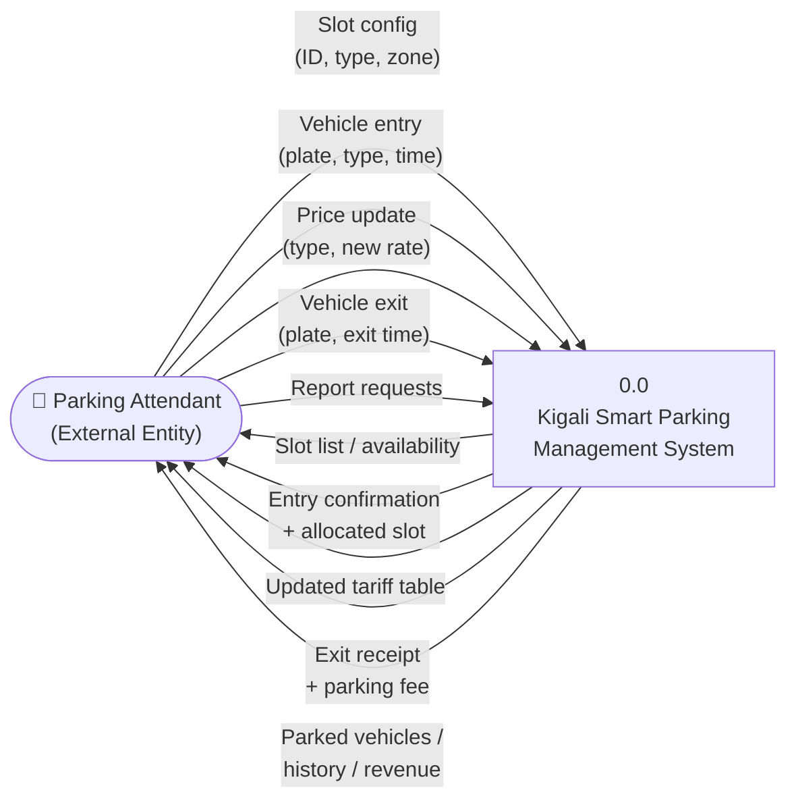
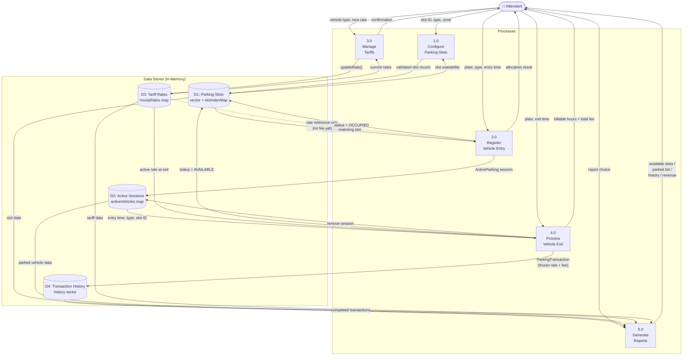
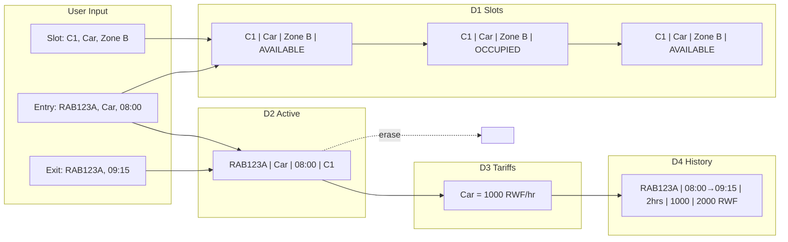
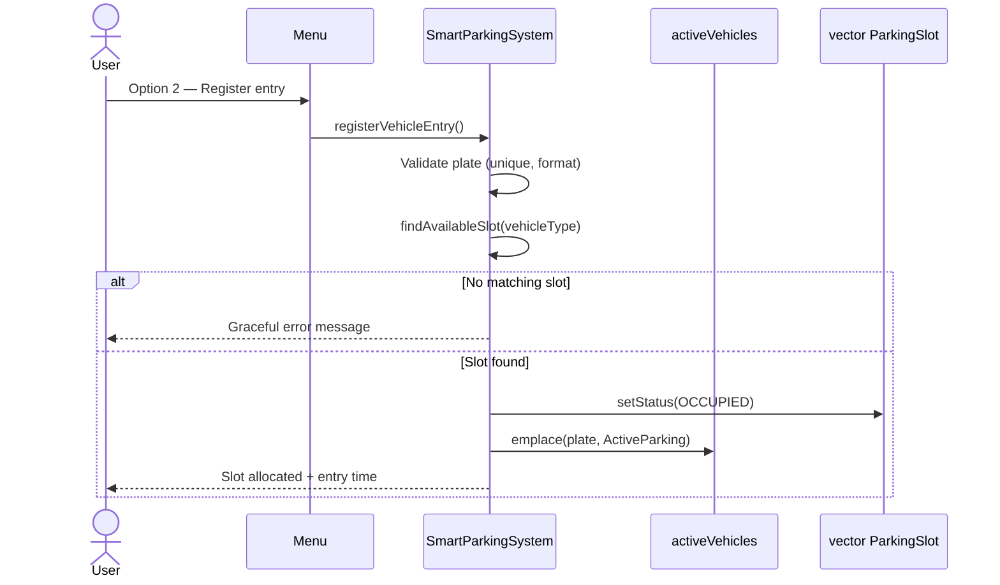
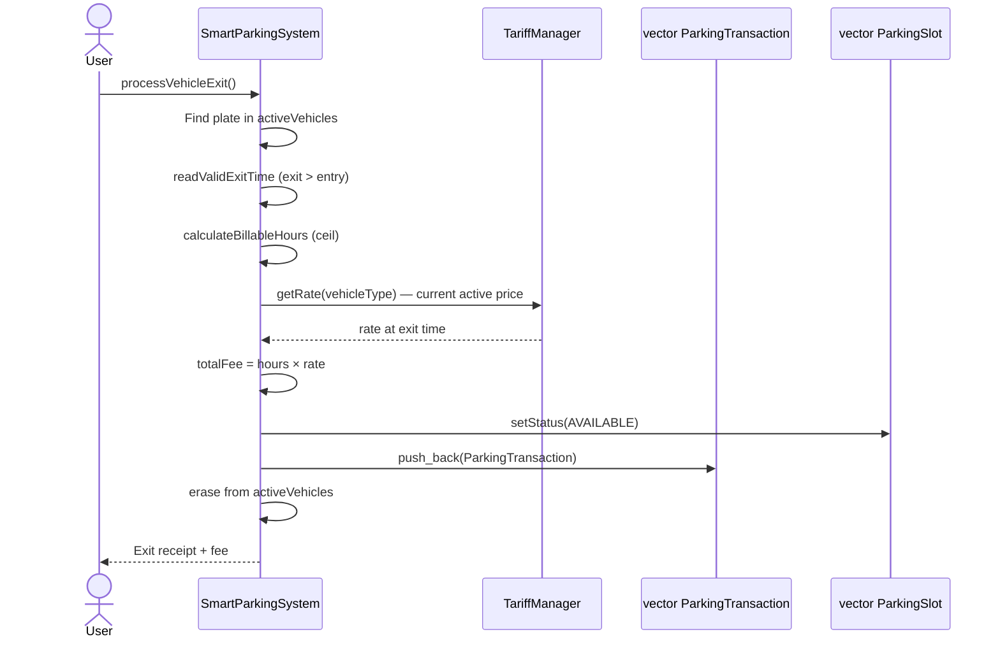
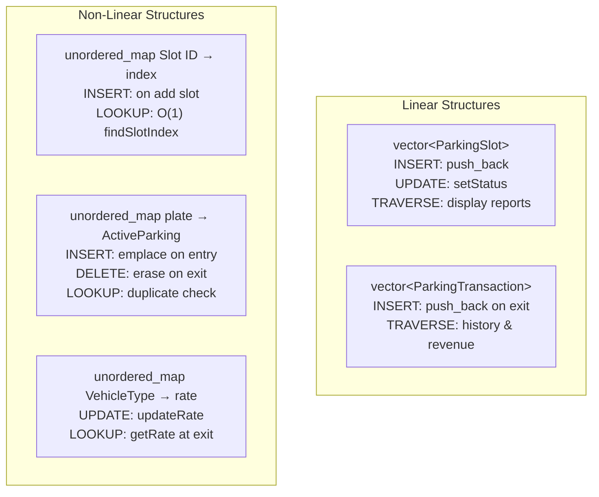
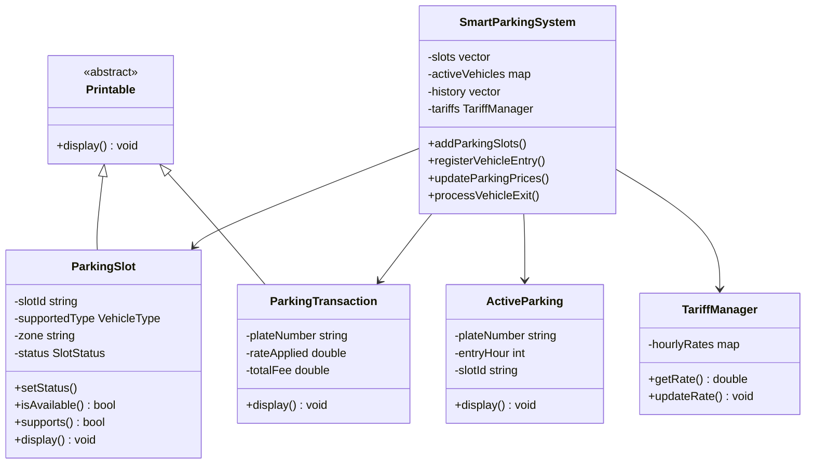

# System Architecture & Requirements Checklist

This document maps every exam requirement to the implementation in `2026_exam.cpp`.

---

## 1. System Architecture (High-Level)

---

## 2. Core System Components

---

## 3. Component Responsibilities

| Component | Role | File / Location |
|-----------|------|-----------------|
| `main()` | Menu loop, routes user choice to system methods | `2026_exam.cpp` |
| `SmartParkingSystem` | Central controller for all tasks and reports | `2026_exam.cpp` |
| `TariffManager` | Default rates, price updates, rate lookup at exit | `2026_exam.cpp` |
| `ParkingSlot` | Slot ID, type, zone, status (Available/Occupied) | `2026_exam.cpp` |
| `ActiveParking` | Live session: plate, type, entry time, assigned slot | `2026_exam.cpp` |
| `ParkingTransaction` | Completed exit record with frozen rate and fee | `2026_exam.cpp` |
| `Printable` | Abstract display interface (polymorphism) | `2026_exam.cpp` |
| Validation helpers | Input sanitization, range checks, business rules | `2026_exam.cpp` |

---

## 4. Data Flow Diagram (DFD)

A **Data Flow Diagram** shows how information moves through the system — from user input, through processing, into data stores, and back out as reports/receipts.

### 4.0 Context Diagram (Level 0)

Shows the whole system as one process and its external interactions.

---

### 4.1 Level 1 Data Flow Diagram

Breaks the system into main processes, data stores, and labeled data flows.

#### DFD Legend

| Symbol | Meaning | Implementation |
|--------|---------|----------------|
| 👤 External Entity | User outside the system | Parking attendant at console |
| `1.0 – 5.0` Process | Business logic action | Methods in `SmartParkingSystem` |
| `D1 – D4` Data Store | Where data is kept | `vector` / `unordered_map` in memory |
| Arrow label | Data that flows | Input fields, records, or report output |

#### Process → Code Mapping

| DFD Process | Menu Option | Code Function |
|-------------|-------------|---------------|
| 1.0 Configure Slots | 1 | `addParkingSlots()` |
| 2.0 Register Entry | 2 | `registerVehicleEntry()` |
| 3.0 Manage Tariffs | 3, 10 | `updateParkingPrices()`, `displayTariffs()` |
| 4.0 Process Exit | 4 | `processVehicleExit()` |
| 5.0 Generate Reports | 5–8, 9, 11 | `displayAvailableSlots()`, `displayParkedVehicles()`, etc. |

#### Data Store Contents

| Store | Fields Stored | Updated When |
|-------|---------------|--------------|
| **D1** Parking Slots | Slot ID, vehicle type, zone, status | Task 1 (add), Task 2 (occupy), Task 4 (release) |
| **D2** Active Sessions | Plate, type, entry time, slot ID | Task 2 (insert), Task 4 (delete) |
| **D3** Tariff Rates | Motorcycle/Car/Truck hourly rate | Startup (defaults), Task 3 (update) |
| **D4** History | Plate, times, hours, rate applied, fee | Task 4 only (append-only) |

---

### 4.2 End-to-End Data Flow (Lifecycle)

Shows how one vehicle's data moves through all stores from entry to exit.

---

### 4.3 Process-Specific Flows (Sequence Diagrams)

#### 4.3a. Vehicle Entry Flow

#### 4.3b. Vehicle Exit Flow

---

## 5. Data Structures & DSA Operations

| Structure | Justification |
|-----------|---------------|
| `vector<ParkingSlot>` | Sequential storage; easy traversal for slot reports |
| `unordered_map<string, int>` | O(1) slot lookup by ID during exit and validation |
| `unordered_map<string, ActiveParking>` | O(1) duplicate-plate check and active session lookup |
| `vector<ParkingTransaction>` | Append-only history; preserves original rate per transaction |
| `unordered_map<VehicleType, double>` | Fast rate lookup and update per vehicle type |

---

## 6. Full Requirements Checklist

Legend: ✅ Implemented | ⚠️ Partial / Note

### A. Integrated Situation — System Must Manage

| # | Requirement | Status | Implementation |
|---|-------------|--------|----------------|
| A1 | Parking slot configuration and availability | ✅ | `addParkingSlots()`, `displayAvailableSlots()`, `SlotStatus` enum |
| A2 | Vehicle entry registration | ✅ | `registerVehicleEntry()` |
| A3 | Parking duration tracking and fee calculation | ✅ | `calculateBillableHours()`, `processVehicleExit()` |
| A4 | Vehicle exit and payment recording | ✅ | `processVehicleExit()`, `ParkingTransaction` |
| A5 | Report: available slots | ✅ | `displayAvailableSlots()` — Menu 5 |
| A6 | Report: parked vehicles | ✅ | `displayParkedVehicles()` — Menu 6 |
| A7 | Report: vehicle history | ✅ | `displayParkingHistory()` — Menu 7 |
| A8 | Report: daily revenue | ✅ | `displayDailyRevenue()` — Menu 8 |
| A9 | In-memory data structures only (no database) | ✅ | All data in `vector` / `unordered_map` |
| A10 | Efficient and scalable design | ✅ | O(1) hash map lookups, vector traversal for reports |
| A11 | Good OOP design practices | ✅ | See Section 7 below |

---

### B. Task 1 — Parking Slot Configuration

| # | Requirement / Attribute | Status | Implementation |
|---|-------------------------|--------|----------------|
| B1 | Slot ID (unique) | ✅ | `readValidSlotId()`, `slotIndexMap`, duplicate rejection |
| B2 | Supported vehicle type (Motorcycle / Car / Truck) | ✅ | `VehicleType` enum, `readVehicleType()` |
| B3 | Zone (location) | ✅ | `readValidZone()`, stored in `ParkingSlot` |
| B4 | Slot status (Available / Occupied) | ✅ | `SlotStatus` enum, updated on entry/exit |
| B5 | Slots uniquely identified | ✅ | `normalizeKey()` + `slotIndexMap` |
| B6 | Appropriate data structure for slots | ✅ | `vector<ParkingSlot>` + `unordered_map` index |

---

### C. Task 2 — Vehicle Entry Management

| # | Requirement / Attribute | Status | Implementation |
|---|-------------------------|--------|----------------|
| C1 | Vehicle plate number (unique) | ✅ | `readValidPlate()`, case-insensitive duplicate check |
| C2 | Vehicle type (Car, Truck, Motorcycle) | ✅ | `VehicleType` enum |
| C3 | Entry time | ✅ | Hour (0–23) + minute (0–59) with validation |
| C4 | Allocated parking slot | ✅ | Auto-allocated via `findAvailableSlot()` |
| C5 | Cannot park same vehicle twice at once | ✅ | `activeVehicles` map blocks duplicate plate |
| C6 | Graceful handling when no slot available | ✅ | Message + tip; no crash |
| C7 | Appropriate data structures for records | ✅ | `unordered_map` for active sessions, `vector` for slots |

---

### D. Task 3 — Duration & Fee Calculation

| # | Requirement | Status | Implementation |
|---|-------------|--------|----------------|
| D1 | Calculate duration from entry and exit time | ✅ | `timeToMinutes()`, `calculateBillableHours()` |
| D2 | Apply rates based on vehicle type | ✅ | `TariffManager::getRate()` |
| D3 | Compute total parking fee | ✅ | `billableHours × rate` in `processVehicleExit()` |
| D4 | Allow update of parking price | ✅ | `updateParkingPrices()` — Menu 3 |
| D5 | Price updates must not affect completed records | ✅ | `rateApplied` stored in `ParkingTransaction` at exit |

#### Task 3 Rules

| # | Rule | Status | Implementation |
|---|------|--------|----------------|
| R3.1 | Default hourly prices for each vehicle type | ✅ | `TariffManager` constructor |
| R3.2 | Controlled option to update prices while running | ✅ | Menu option 3 |
| R3.3 | Fees use current active prices at exit time | ✅ | `tariffs.getRate()` called during exit |
| R3.4 | Price updates do not change history | ✅ | History stores `rateApplied` per transaction |
| R3.5 | Motorcycle default: 500 RWF/hour | ✅ | `hourlyRates[MOTORCYCLE] = 500.0` |
| R3.6 | Car default: 1,000 RWF/hour | ✅ | `hourlyRates[CAR] = 1000.0` |
| R3.7 | Truck default rate | ⚠️ | Exam lists Motorcycle & Car only; Truck set to **2,000 RWF** (reasonable default) |
| R3.8 | Fees calculated only at exit | ✅ | No fee on entry; fee in `processVehicleExit()` only |
| R3.9 | Partial hours charged as full hours | ✅ | `ceil(duration / 60.0)` — 15 min → 1 hr, 1h20 → 2 hr |

---

### E. Task 4 — Vehicle Exit & Parking Update

| # | Requirement | Status | Implementation |
|---|-------------|--------|----------------|
| E1 | Release occupied parking slot | ✅ | `slots[slotIndex].setStatus(AVAILABLE)` |
| E2 | Calculate and display parking fee | ✅ | Exit receipt with hours, rate, total |
| E3 | Update all relevant system records | ✅ | Slot status, remove from active, add to history |
| E4 | Store transaction for future reference | ✅ | `history.push_back(ParkingTransaction(...))` |

---

### F. Design & DSA Requirements

| # | Requirement | Status | Implementation |
|---|-------------|--------|----------------|
| F1 | Design system architecture | ✅ | This document + layered design in code |
| F2 | Identify core system components | ✅ | Section 3 above |
| F3 | Linear and/or non-linear data structures | ✅ | `vector` (linear) + `unordered_map` (hash table) |
| F4 | Justify data structure choices | ✅ | Comments in `2026_exam.cpp` header + Section 5 above |
| F5 | Insertion operations | ✅ | `push_back`, `emplace` |
| F6 | Deletion operations | ✅ | `activeVehicles.erase()` on exit |
| F7 | Update operations | ✅ | `setStatus()`, `updateRate()` |
| F8 | Traversal operations | ✅ | All `display*()` report functions |
| F9 | Encapsulation | ✅ | Private fields in classes, `TariffManager` |
| F10 | Abstraction | ✅ | `Printable` abstract base class |
| F11 | Inheritance | ✅ | `ParkingSlot`, `ParkingTransaction` extend `Printable` |
| F12 | Polymorphism | ✅ | Virtual `display()` overridden in subclasses |
| F13 | Validate inputs | ✅ | Plate, slot ID, zone, menu, time, rate validators |
| F14 | Handle exceptional cases gracefully | ✅ | Empty data, no slots, not found, exit before entry |
| F15 | Menu-driven / console interface | ✅ | 12-option menu in `main()` |
| F16 | Test inputs provided | ✅ | `README.md` sample flow + `test_validation.sh` |
| F17 | README with compile/run, rates, menu | ✅ | `README.md` |
| F18 | No internet required | ✅ | Standalone C++, no external dependencies |

---

### G. Extra Validation (Beyond Minimum — for Full Marks)

| # | Enhancement | Status | Implementation |
|---|-------------|--------|----------------|
| G1 | Reject non-numeric menu input | ✅ | `readMenuChoice()` loop |
| G2 | Reject out-of-range menu choice | ✅ | Range check 1–12 |
| G3 | Reject invalid plate format | ✅ | `isValidPlate()` — 3–15 alphanumeric |
| G4 | Reject invalid slot ID (symbols) | ✅ | `isValidSlotId()` |
| G5 | Reject empty input | ✅ | `readNonEmptyLine()` |
| G6 | Reject exit time before entry | ✅ | `readValidExitTime()` |
| G7 | Case-insensitive plate lookup | ✅ | `normalizeKey()` |
| G8 | Vehicle type must match slot type | ✅ | `findAvailableSlot()` + `supports()` |
| G9 | Max slot limit | ✅ | `MAX_SLOTS = 100` |
| G10 | Slot status double-check before entry | ✅ | Re-verify `isAvailable()` before occupy |

---

## 7. OOP Mapping (Quick Reference)

---

## 8. Summary Scorecard

| Category | Total Items | Implemented | Notes |
|----------|-------------|-------------|-------|
| Integrated situation (A) | 11 | 11 ✅ | All covered |
| Task 1 — Slots (B) | 6 | 6 ✅ | |
| Task 2 — Entry (C) | 7 | 7 ✅ | |
| Task 3 — Fees (D + Rules) | 14 | 13 ✅ / 1 ⚠️ | Truck rate not in exam text |
| Task 4 — Exit (E) | 4 | 4 ✅ | |
| Design & DSA (F) | 18 | 18 ✅ | |
| Extra validation (G) | 10 | 10 ✅ | Bonus robustness |
| **Overall** | **70** | **69 ✅ / 1 ⚠️** | **~99% exam coverage** |

> **Only note:** The exam specifies default tariffs for Motorcycle (500) and Car (1,000) but includes Truck as a vehicle type without a stated rate. Our implementation uses **2,000 RWF/hour** for Truck. If your examiner asks, explain that Truck is supported as a type and given a logical default rate.
